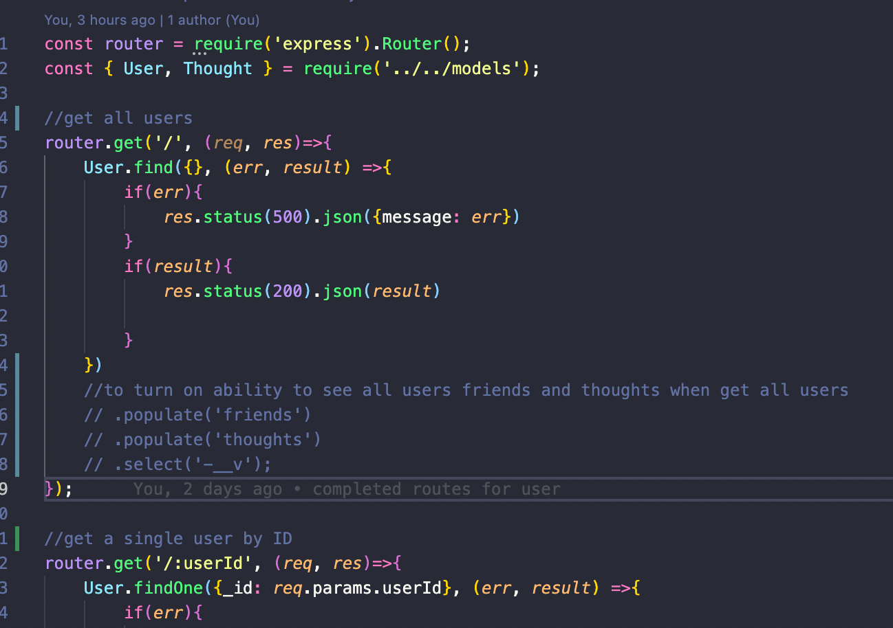

# socialStack_db

This program was built to mimic various routes that could be used in the back end of a social-media platform. It has no front end at all and is not deployed, so it needs to be cloned to your local machine and run using something to mimic a UI. This project would be much more satisfying if it had a front end component to interact with as well, I like to see things fleshed out and fulfilled, but I get the principle.
    
The purpose of this program is to solidify our understanding of how to use routes to interact with the MongoDB using the Mongoose ORM. I am feeling very comfortable with how these work, although I am still settling on what style I want to use to write them (async/await vs chaining, etc).

I learned a lot about interacting with databases using routes during this assignment. It is interesting how many opportunities there are in the data lifecycle where you can validate or manipulate data.

## Table of Contents
* [Installation](#installation)
* [Instructions for Use](#instructions-for-use)

* [License](#license)
    
## Installation
1. This program requires the following programs be installed:<ul><li>Node.js</li><li>MongoDB</li><li>nodemon (if using)</li><li>npm express</li><li>npm mongodb</li><li>npm mongoose</li><li>Insomnia</li><li>MongoDB Compass (beneficial for easy deletion of everything if you want to start fresh)</li></ul>

2. Before running this program, please have the following information on hand and / or loaded into your 'asset/images' folder:<ul>none</ul>

## Instructions for Use
<ol><li>Clone down the repo to your local machine, open up in your code editor, run `npm i` in your terminal at the level of the server.js file to install the necessary dependencies.</li><li>Once the dependencies are installed, start the server (I prefer using nodemon server.js).</li><li>Once the server is up, open Insomnia and begin creating your request routes for testing. The server is set up to run on port 3002 as a default. Follow the url paths defined in the routes folder. Each route has a comment declaring what the route should do. (Please watch the accompanying video walkthrough for a demonstration if you are not sure how to do this). Please note that some of these routes will need associated IDs input in the URL in order to function correctly. It will always be more convenient to create the thing you want to test routes for first, then get the collection, then test the routes that require the input of specific IDs (the get by ID, edit, and delete routes).</li><li>Once your routes are set up in insomnia, begin by creating users, so you’ll have something to interact with. I prefer to use the JSON insomnia input, but the server contains middleware to enable the URL encoded form option as well. Required parameters for user creation are <strong>username</strong> and <strong>email</strong>. Validation is in place to ensure you are inputting an email in the correct format.</li><li>Once you have created two or three users, you will be able to test the “get all users” and “get user by ID” routes, as well as editing a single user, deleting a single user, and adding and removing a user from another user’s friends list. You will note that when you get a single user by ID, you will receive additional more specific information on their friends and their associated thoughts. You can enable this on the “get all users” route as well by uncommenting the labeled code within the first route in the user-routes.js file.</li><li>After walking through the user routes, try posting some thoughts, then have users leave reactions to the thoughts of other users. The required input fields for thoughts are <strong>thoughtText</strong>, <strong>username</strong>, and a userID included in the URL. The required input fields for reactionss are <strong>reactionBody</strong>, <strong>username</strong>, and a thoughtID included in the URL. You also have the capability to edit or delete a thought, and delete a reaction to another user’s thought.</li><li>Please watch the accompanying video walkthrough for a more detailed look at how to use the program.</li></ol>

Here is a [video walkthrough](https://drive.google.com/file/d/14-i6S05TKsxG-hVFkEHDB__3y62rfsYb/view?usp=sharing).

## License
The files in this repository are covered by the [MIT License](https://choosealicense.com/licenses/mit/).
